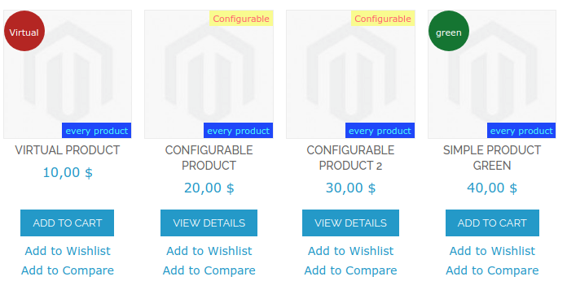
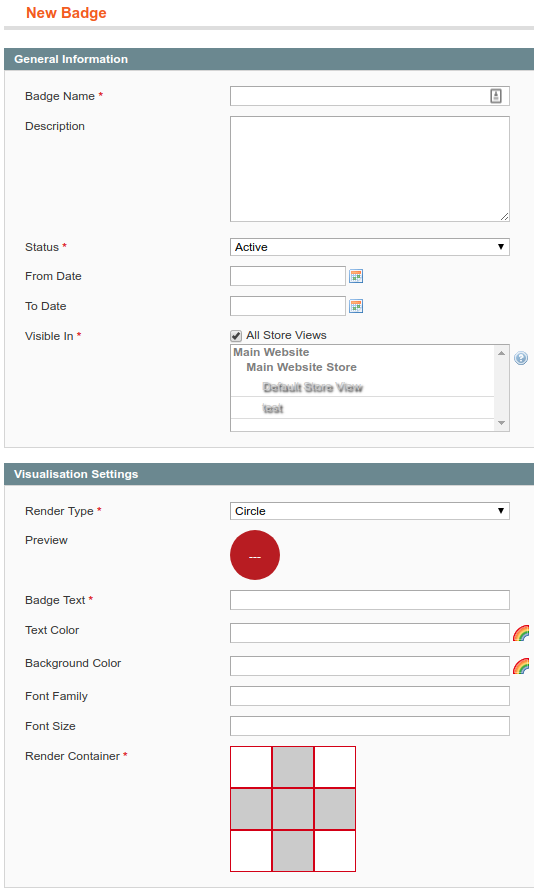
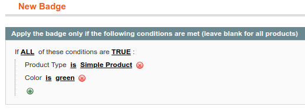

# Product Badges (Magento 1)

> Summary: The Product Badges extension offers you the possibility to add highly customizable badges to your product images without having any performance impact. You can freely define where a badge should be shown via price-rule-like conditions.

## Description

The extension offers you the possibility to add highly customizable badges to your product images without having any performance impact. The extension comes with a custom indexer, which computes the mapping of badges to products in the background, so that the actual rendering of the badges is blazingly fast. It also comes with a smart queueing system, so that even in the backend, there is no slowdown. Another big plus is that you can define the matching products for a specific badge via a price-rule-like interface. You can use and combine all product attributes to define badge conditions.

### Example

Here is an example, where we defined four different badges. One badge for all virtual products, one for all configurables, one for all products and one for green products:



Here are some ideas which badges you could create with this extension:
* new (to highlight recently added products)
* configurable (to show that additional options are available on the product page)
* free shipping (to highlight products, which are free to ship)
* on sale (to highlight products, which are currently on sale)
* out of stock (to indicate that the product is currently not available)
* manufacturer logo (to highlight the manufacturer of the product)
* … (be creative! there are thousands of possibilities based on your product catalog!)

## Requirements
* PHP >= 5.5.0
* Mage_Catalog
* Mage_Core

## Compatibility
* Magento >= 1.9 and < 2.0

## Installation Instructions
1. Install via Modman or copy all the files into your document root.
2. Update your main product list template (usually `app/design/frontend/package/theme/template/catalog/product/list.phtml`):
    1. In the beginning of the file, after the product collection assignment (after the line $_productCollection=$this->getLoadedProductCollection();), add: 
        ```php
        /** @var CustomGento_ProductBadges_Helper_Data $_badgesHelper */
        $_badgesHelper = Mage::helper('customgento_productbadges');
        $_badgesHelper->initProductBadgeCollection($_productCollection);
        ```
    2. Inside of the link, which encloses the product image (usually an `<a>` tag with a class `product-image`), add: 
        ```php
        <?php echo $_badgesHelper->generateBadgesHtml($_product); ?>
        ```
        Mind that there are often two occurrences of the mentioned tag - one for the list view and one for the grid view. Please update both.
3. Repeat step 2 for all product list templates, where you want product badges to appear. Possible other locations:
    - `app/design/frontend/package/theme/template/catalog/product/list/related.phtml`
    - `app/design/frontend/package/theme/template/checkout/cart/crosssell.phtml`
    - ... (you can use `grep -R 'products-list' app/design/frontend/package/theme/` to find possible locations)
4. Update your product view media template (usually `app/design/frontend/package/theme/template/catalog/product/view/media.phtml`):
    - In the beginning of the file, after the helper creation (after the line `$_helper = $this->helper('catalog/output');`), add:
        ```php
        /** @var CustomGento_ProductBadges_Helper_Data $_badgesHelper */
        $_badgesHelper = Mage::helper('customgento_productbadges');
        ```
    - Inside of the container, which encloses the main product image (usually a `<div>` tag with a class `product-image-gallery`), add:
        ```php
        <?php echo $_badgesHelper->generateSingleProductBadgesHtml($_product); ?>
        ```
5. Clear the cache.

## Configuration

### General Settings
You will find the settings under: `System > Configuration > Catalog > Product Badges`.


You can `enable` or `disable` the extension there. This is useful to toggle the extension functionality without touching any code.

### Adding Badges
To create new badges or edit existing ones, go to `Catalog > Product Badges` and click on `Add New Badge` or click an existing badge respectively.



### _General Settings_
* **Badge Name**: Internal name, so that you can easily identify your badge.
* **Description:** Internal description, so that you remember what the complex conditions you defined months ago really do ;-)
* **Status:** Whether the badge should currently be shown.
* **From Date:** From which date onwards the badge should be shown (inclusive).
* **To Date:** Until which date the badge should be shown (inclusive).
* **Visible In:** In which store views the badge should be visible.

### _Visualization Settings_
* **Render Type:** Whether the badge should be shown as a circle, a rectangle or with a custom image.
* **[circle, rectangle] Badge Text:** The text, which should be shown on the badge.
* **[circle, rectangle] Text Color:** The color of the text you defined under `Badge Text`.
* **[circle, rectangle] Background Color:** The background color of the shape you defined under `Render Type`.
* **[circle, rectangle] Font Family:** The font for the text you defined under `Badge Text`.
* **[circle, rectangle] Font Size:** The font for the text you defined under `Badge Text`.
* **[image] Badge Image:** The image, which should be shown as a badge in the format `jpg`, `png` or `gif`.
* **Render Container:** In which corner of the product image the badge should be shown. Simply click on the white boxes to select the respective corner.

A preview of the badge is shown as soon as you configured the visualization settings.

### _Conditions_
In the left column, you can switch to the conditions tab, where you can define to which products this badge should be applied:



> **Important:** If you do not define any conditions, the badge is applied to all products. You probably know the interface from the catalog or shopping cart price rules.

## Troubleshooting - I installed the extension, but it does not work

1. Do you use the latest version of the extension?
2. Make sure that the extension is not disabled under `Stores > Configuration > Catalog > Product Badges`.
3. Make sure that your `cronjob` is running. Since we use a queue to update our index, there may be a little delay until you see the badge on your page.
4. Make sure that the index is up-to-date. Re-index the `CustomGento Product Badges` index under `System > Index Management` or via the CLI.
5. Make sure that the cache of the product / category has been refreshed if you use a full page cache like `Varnish` or `Lesti_Fpc`.
6. Check if the product fulfils all conditions you defined.

## Uninstallation

1. Remove all extension files from your Magento installation.
2. Clear the cache.
3. Run the following SQL query after removing the extension files:
    ```SQL
    DROP TABLE `customgento_productbadges_queue`;
    DROP TABLE `customgento_productbadges_badges_config`;
    DELETE FROM `core_resource` WHERE code = 'customgento_productbadges_setup';
    ```
4. Drop all tables matching the pattern `customgento_productbadges_badges_index_*`. The extension creates one table per store, so that the number of tables depends on your configuration.

## Support
> If you have any issues with this extension, feel free to open an issue here: https://github.com/customgento/CustomGento_ProductBadges/issues


## Licence

To be defined!

## Copyright
© 2018-2021 CustomGento GmbH

